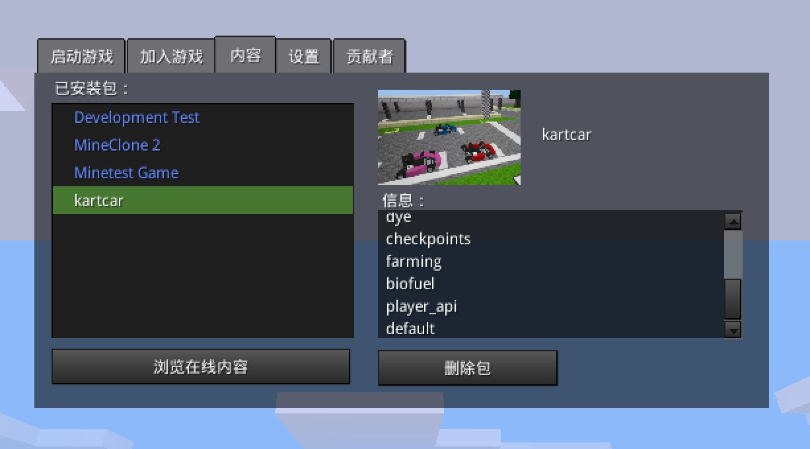

- [[Minetest]]
- [[Minetest+W3itch]]
- [[WhyYouAre]]
	- 安装了Minest MacOS客户端
		- 测试Mod
			- 
	- 测试了在web client登录
		- https://mt.kuso.io/minetest/?address=api.w3itch.io&name=Bob
		-
- [[Minetest]] [[May 26th, 2022]] 下午和 [[SeeDAO]] 开发组有个会，[[Meta Space]] 和 翻译工会 在 [[May 28th, 2022]] 和 [[SeeDAO]]  有个会，然后 calendar 可以 [[May 25th, 2022]] release
  这样 [[小岛美奈子]] 可以在 [[Twitter]] 上开始 shill，为 gitcoin grant 做铺垫
  大概这几个工作是可并行的
- 关于登录的基础部分因为好几个地方都要用到，能提取出来复用是很好的
	- Meta Space 和 W3itch本质上是同样的方案，只是一个用了[[MicroService]]架构，一个是 [[Matataki]] 的,复用还是可能的
	- 如果是和其他服务异构集成，那还是一个专门的服务器带上通过API来集成比较好了，类似调用Google API