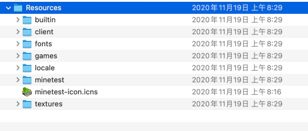

- 安装实例
	- MacOS下安装的样子
		- 
		- 如果是Apple M1的
			- 可以到这里 https://github.com/neoascetic/minetest/releases 下载看看
	- Ubuntu下用snap安装的样子
		- ```
		  ubuntu@ip-172-31-93-51:/snap/minetest/current/share/minetest$ ls -al
		  total 0
		  drwxr-xr-x 7 root root  110 Apr 13  2021 .
		  drwxr-xr-x 9 root root  128 Apr 13  2021 ..
		  drwxr-xr-x 9 root root  164 Apr 13  2021 builtin
		  drwxr-xr-x 3 root root   30 Apr 13  2021 client
		  drwxr-xr-x 2 root root 1284 Apr 13  2021 fonts
		  drwxr-xr-x 4 root root   63 Apr 13  2021 games
		  drwxr-xr-x 3 root root   27 Apr 13  2021 textures
		  ubuntu@ip-172-31-93-51:/snap/minetest/current/share/minetest$ 
		  ```
		- [[Garfield550]]的验证
			- snap 装的 minetest 只能访问 snap 沙盒里的文件，然后 minetest 的 cwd 是 snap/minetest/current。
			  我把 /home/minetest/.minetest 做了个软链接。ln -sv .minetest snap/minetest/current
	- Ubuntu下通过下载安装包安装的样子
		- [[WhyYouAre]]的验证
			- 从 https://downloads.minetest.org/ 找到
			-
		-